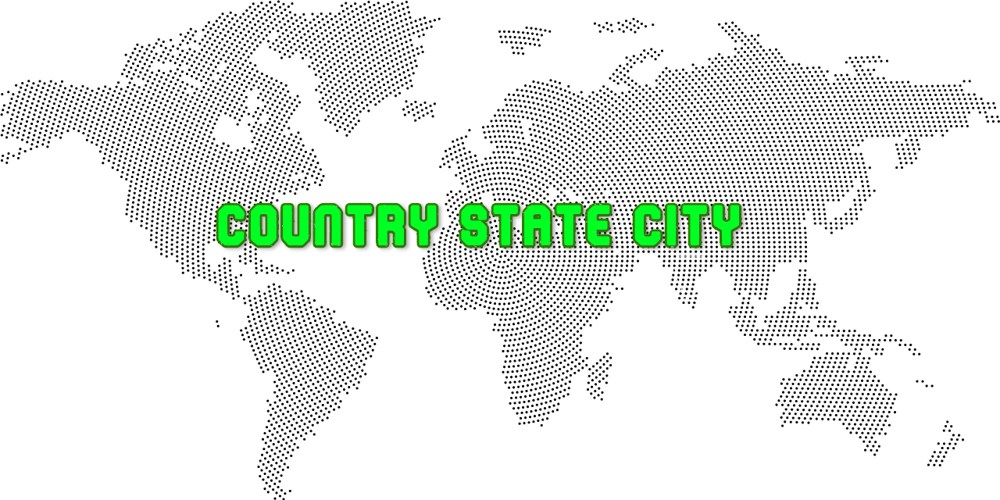

  

# Countries States Cities Database

Full Database for world countries, states and cities are Covered & Populated with Different Combinations & Versions.
 

## Formats Available

- CSV
- SQL
- JSON

<b>Insights</b>

<ul>
<li>Total Countries : 247</li>
<li>Total States/Regions : 4,854</li>
<li>Total Cities/Towns : 141,851</li>
</ul>
 

<h2>Notes</h2>

<blockquote>

This free database does not guarantee for the complete list of world countries, states & cities. You can manually change the spelling mistakes, duplicates or add edit any records, which are incorrect.

Reason behind making this repo: I ran through many websites to get perfect combination of state, city & countries. Some were with missing states, some with large filesize.

</blockquote>
 

<h3>Follow Me At:</h3>

  

 
<h2>Suggestions / Feedbacks</h2>
<pre>Suggestions & Feedbacks are Most Welcome
<a href="mailto:marufmarzuq18@gmail.com">marufmarzuq18@gmail.com</a>
</pre>
 

That's all Folks. Enjoy.

🤙🍻 <i>Maruf Marzuq</i> 🤙🍻
